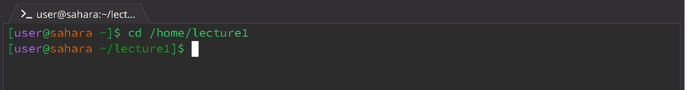
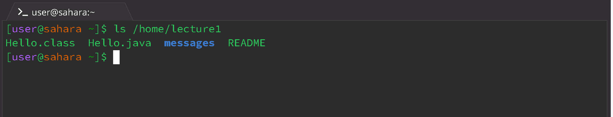
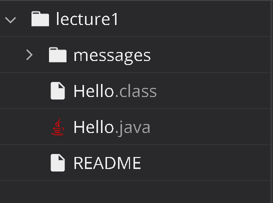
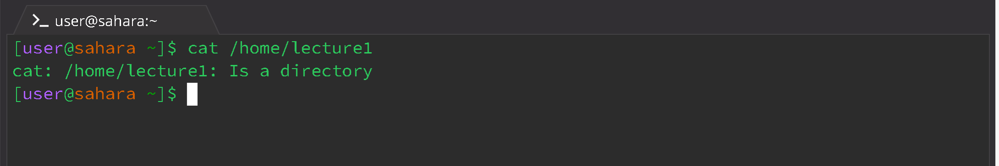

# Lab Report 1 - Remote Access and FileSystem (Week1)

### Command `cd`

* Using the command with No Arguments
  
  

  The working directory when the command is run is `/home`.

  No output was produced because there was no argument provided in the command line. As `cd` stands for "Change Directory," in the  format `cd <path>`, when no path was passed in as an argument, there is no change in directory.

  This output is not an error.

* Using the command with a path to a directory as an argument

  

  The working directory when the command is run is `/home/lecture1`.

  Again, there is no output, but the prefix is changed from `[user@sahara ~]` to `[user@sahara ~/lecture1]`. This shows that the current directory has been changed from `/home` to `/home/lecture1`, which is the purpose of the `cd` command.

  This output is not an error.
  
* Using the command with a path to a file as an argument

### Command `ls`

* Using the command with No Arguments

  

  The working directory when the command is run is `/home`.

  `ls` lists files and folders in a given path, formatted as `ls <path>`. Because there is no argument (path) provided, the command runs `ls` with the current directory, `/home`, and prints the files/folders in that directory: `lecture1`.

  This output is not an error.

* Using the command with a path to a directory as an argument

  

  The working directory when the command is run is `/home`.

  When the `ls` command is run, four separate items are printed: `Hello.class`, `Hello.java`, `messages`, and `README`; these are the four files that are located in the path `/home/lecture`, the argument included in the command line. Referring to the files tab (see below), we can confirm that these four items are indeed the files that are nestled under `lecture1`.

    

  This output is not an error.
  
* Using the command with a path to a file as an argument

### Command `cat`

* Using the command with No Arguments

  

  The working directory when the command is run is `/home`

  `cat` is short for "Concatenate," which prints the contents of one or more files given by paths in the format `cat <path1> <path2> ...`. Due to there being no argument, there is nothing for the terminal to print.

  This output is not an error. However, with the way `cat` works, the terminal continues running and `cat` defaults to repeating what the user inputs to the terminal until the terminal is reset. 

* Using the command with a path to a directory as an argument

  

  The working directory when the command is run is `/home`.

  The output when this command line was run is `cat: /home/lecture1: Is a directory`. This is an error statement, caused by an invalid input provided to the terminal. 

    As such, the output is definitely an error. The `cat` command only accepts arguments that are paths to *files*, but the command line provides an argument that is a path to a *directory* instead. Therefore, an error statement is printed to let the user know why the program was not run correctly.
  
* Using the command with a path to a file as an argument
