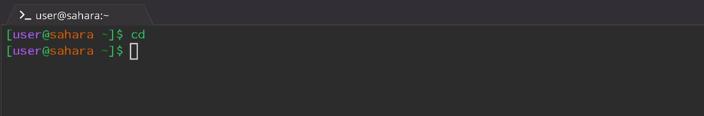
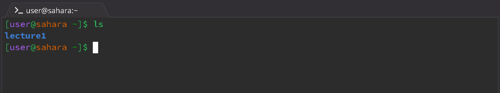
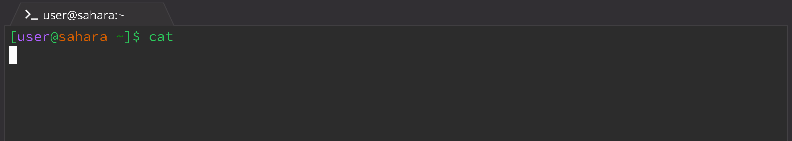

# Lab Report 1 - Remote Access and FileSystem (Week1)

### Command `cd`

* Using the command with No Arguments
  
  

  The working directory when the command was run was `/home`.

  No output was produced because there was no argument provided in the command line. As `cd` stands for "Change Directory," in the  format `cd <path>`, when no path was passed in as an argument, there is no change in directory.

  This output is not an error.

* Using the command with a path to a directory as an argument

* Using the command with a path to a file as an argument

### Command `ls`

* Using the command with No Arguments

  

  The working directory when the command was run was `/home`.

  `ls` lists files and folders in a given path, formatted as `ls <path>`. Because there is no argument (path) provided, the command runs `ls` with the current directory, `/home`, and prints the files/folders in that directory: `lecture1`.

  This output is not an error.

* Using the command with a path to a directory as an argument

* Using the command with a path to a file as an argument

### Command `cat`

* Using the command with No Arguments

  

  The working directory when the command was run was `/home`

  `cat` is short for "Concatenate," which prints the contents of one or more files given by paths in the format `cat <path1> <path2> ...`. Due to there being no argument, there is nothing for the terminal to print.

  This output is not an error. However, with the way `cat` works, the terminal continues running and `cat` defaults to repeating what the user inputs to the terminal until the terminal is reset. 

* Using the command with a path to a directory as an argument

* Using the command with a path to a file as an argument
