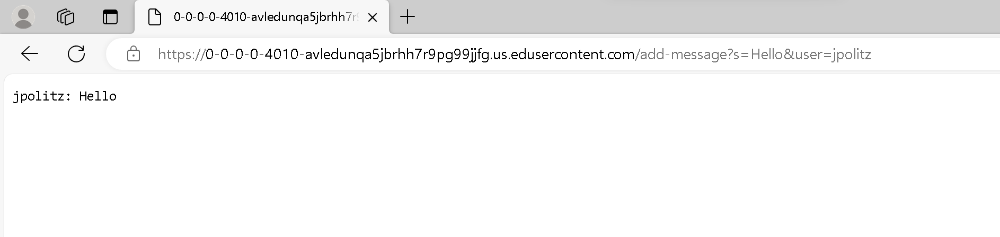
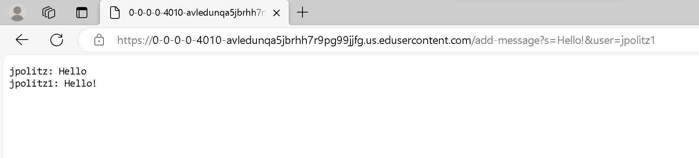

### Lab Report 2 - Servers and SSH Keys (Week 3)

#### Part 1 
`ChatServer.java`:
```
import java.io.IOException;
import java.net.URI;

class Handler implements URLHandler {
    String str = "";
    int num = 0;
    public String handleRequest(URI url){
        if(url.getPath().equals("/")){
            return(String.format("%s", str));
        }
        else if(url.getPath().contains("/add")){
            String[] parameters = url.getQuery().split("=");
            if(parameters[1].length() < 6 || parameters.length == 2){
                return "400 Bad Request";
            }
            String user = parameters[2];
            String msg = parameters[1].split("&")[0];
            if(num == 0){
                str = String.format("%s: %s", user, msg);
                num++;
            }
            else{
                str = String.format("%s \n%s: %s", str, user, msg);
            }
            return(String.format("%s", str));
        }
        else{
            return "400 Bad Request";
        }
    }   
}


class ChatServer {
    public static void main(String[] args) throws IOException {
        if(args.length == 0){
            System.out.println("Missing port number! Try any number between 1024 to 49151");
            return;
        }

        int port = Integer.parseInt(args[0]);

        Server.start(port, new Handler());
    }

}
```



__Executing `/add-message` for the first time__

* The only method in my program, `handleRequest`, is called.
* The  


__Executing `/add-message` for the second time__

* The only method in my program, `handleRequest`, is called.

#### Part 2


#### Part 3
To be honest, a majority of what was taught in this class thus far has been new and (formerly) foreign material to me. I think one of the more interesting things I learned has been about creating and operating web servers. The aspect of creating the actual server itself is still a bit unclear to me, but I think I have gotten a pretty good handle on taking parts of the input once the web server has been established and using or manipulating data based on that. It took a couple of different sessions of staring at the code and endlessly testing and debugging, but I slowly got to a point where all the logic within the created server file made sense, and I was comfortable manipulating it to my own needs.
