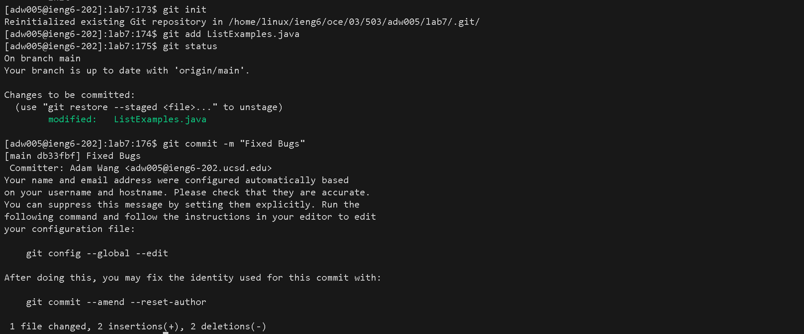

### Lab Report 4 - Vim (Week 7)

Steps:
1. Setup Delete any existing forks of the repository you have on your account
2. Setup Fork the repository
3. The real deal Start the timer!
4. Log into ieng6
5. Clone your fork of the repository from your Github account (using the SSH URL)
6. Run the tests, demonstrating that they fail
7. Edit the code file to fix the failing test
8. Run the tests, demonstrating that they now succeed
9. Commit and push the resulting change to your Github account (you can pick any commit message!)

Step 4 Keys Pressed:

``ssh adw005@ieng6.ucsd.edu`` ``<enter>``

Log into ssh.

Step 5 Keys Pressed:

``git clone git@github.com:yolothe3rd/lab7.git`` ``<enter>``

Clone lab7 repository.

Step 6 Keys Pressed:

``ls`` ``<enter>``

List files in current home directory.

``cd l`` ``<tab>`` ``<enter>``

Change directory into the ``lab7/`` directory.

``ls`` ``<enter>``

List files in ``lab7/`` directory.

``cat t`` ``<tab>`` ``<enter>``

Use the ``cat`` command to list the contents of the ``test.sh`` file, which contains the compile and run commands for the Tester file.

``<ctrl + c>``

Highlight and copy the first line of ``test.sh``, which is the compile command line.

``<ctrl + v>`` ``<enter>``

Paste and run the compile command.

``<ctrl + c>``

Highlight and copy the second line of ``test.sh``, which is the run command for the tester.

``<ctrl + v>`` ``<enter>``

Paste and run the run command for the tester.

Step 7 Keys Pressed:

``ls`` ``<enter>``

List files in the current directory again, to see the name of the java file I need to edit.

``vim ListExamples.java`` ``<enter>``

Open ``ListExamples.java`` using the vim editor.

Part 1:

``<down>`` ``<down>`` ``<down>`` ``<down>`` ``<down>`` ``<down>`` ``<down>`` ``<down>`` ``<down>`` ``<down>`` ``<down>`` ``<down>`` ``<down>`` ``<down>`` 

Use the down arrow key (14 times) to navigate the vim editor, down to the line I want to edit (line15).

``<right>`` ``<right>`` ``<right>`` ``<right>`` ``<right>`` ``<right>`` ``<right>`` ``<right>`` ``<right>`` ``<right>`` ``<right>`` ``<right>`` ``<right>`` ``<right>`` ``<right>`` ``<right>`` ``<right>`` ``<right>`` ``<right>`` 

Use the right arrow key (19 times) to navigate my cursor to the location I want to make an edit.

``x`` ``x`` ``x`` 

Use the ``x`` command to remove the character at the highlighted position, a total of 3 times.

Part 2:

``<down>`` ``<down>`` ``<down>`` ``<down>`` ``<down>`` ``<down>`` ``<down>`` ``<down>`` ``<down>`` ``<down>`` ``<down>`` ``<down>`` ``<down>`` ``<down>`` ``<down>`` ``<down>`` ``<down>`` ``<down>`` ``<down>`` ``<down>`` ``<down>`` ``<down>`` ``<down>`` ``<down>`` ``<down>`` ``<down>`` ``<down>`` ``<down>`` ``<down>``

Continue to navigate down the vim editor (down 29 times) to next intended line (line45).

``<left>`` ``<left>`` ``<left>`` ``<left>``  

Navigate highlight left 4 times.

``i`` ``<backspace>`` ``2`` ``<esc>``

Enter edit mode by pressing ``i``, delete and replace the ``"1"`` with a ``"2"``, then leave edit mode by pressing ``<esc>``.

``:wq`` ``<enter>``

Save and exit out of vim using the ``:wq`` command.

Step 8 Keys Pressed:

``<up>`` ``<up>`` ``<up>`` ``<up>`` ``<enter>``

The javac compile command line is 4 up in the history, so access and compile by pressing ``<up>`` 4 times then ``<enter>``ing.

``<up>`` ``<up>`` ``<up>`` ``<up>`` ``<enter>``

Similarly, the run command line is also now 4 up in the history, so access and then run the command line, also by using ``<up>`` 4 times then hitting ``<enter>``.

Step 9 Keys Pressed:

``git init`` ``<enter>``

Create new git repository using the ``git init`` command.

``git add Li`` ``<tab>`` ``.j`` ``<tab>`` ``<enter>``

Add ``ListExamples.java`` as a file to make a change to using the ``git add`` command. 

``git status`` ``<enter>``

Use the ``git status`` command to make sure that the right file is to be edited.

``git commit -m "Fixed Bugs"`` ``<enter>``

Use the ``git commit`` command to commit and push the edit.

