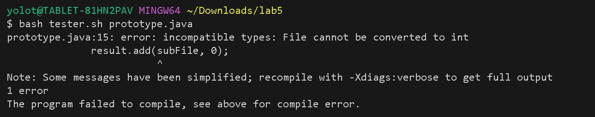
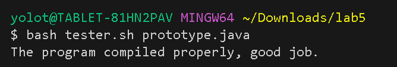
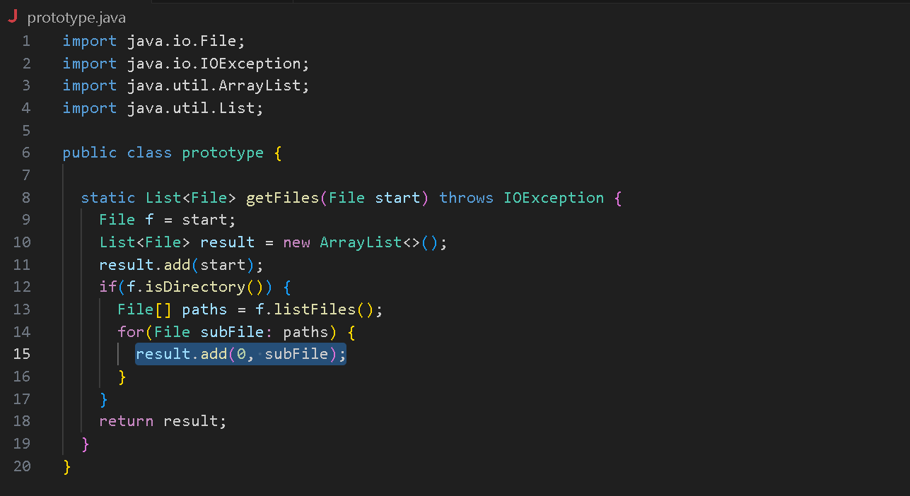

### Lab Report 5 - Putting it All Together (Week 9)

Part 1 - Debugging Scenario

1.	
	See ``prototype.java`` below, as well as error message when I ran the compile bash script. I'm not sure what exactly is causing this compile error.
	
	``prototype.java``:
	```
	import java.io.File;
	import java.io.IOException;
	import java.util.ArrayList;
	import java.util.List;
	
	public class prototype {
	
		static List<File> getFiles(File start) throws IOException {
		  File f = start;
		  List<File> result = new ArrayList<>();
		  result.add(start);
		  if(f.isDirectory()) {
		    File[] paths = f.listFiles();
		    for(File subFile: paths) {
		      result.add(subFile, 0);
		    }
		  }
		  return result;
		}
	}
	```
	
	``tester.sh``:
	```
	CPATH='.:../lib/hamcrest-core-1.3.jar:../lib/junit-4.13.2.jar'
	javac -cp $CPATH *.java
	
	
	if [[ $? -ne 0 ]]
	    then
	        echo "The program failed to compile, see above for compile error."
	        exit 1
 	else
 	    echo "The program compiled properly, good job."
	fi
	```
	
	
	
2. 
	The error message when you try to compile tells you the issue is line 15 in ``prototype.java``. What potential syntax mistake could you have made at the specified location that would require some type of type conversion? Keep in mind the arguments of specific helper methods.

3. 
   	I realized the order of the arguments I used in ``add()`` was incorrect. If there is indexing that is involved, in addition to the desired value to add to the arraylist, the index must come first, before the value that is to be added. Once I switched those around (``result.add(0, subFile);`` instead of ``result.add(subFile, 0);``, the program compiled properly.

   
   
	    
   

Directory/File structure:
```
lab5/
|-  prototype.java
|-  tester.sh
```


Part 2 - Reflection

Coming into this course, I felt as if I had a relatively solid general understanding of how programming worked. Not super knowledgleable regarding specifics of any languages, but my overarching understanding of concepts felt pretty good. Upon taking this course, however, I realized how little I truly understood; Regarding Java, for example, a large majority of the topics taught in 15L have been either mostly or even completely foreign to me.
One concept that I have really found interesting, specifically, has been the utilization of the combination of the terminal and command prompts and lines. This was one of the few concepts that I had come across in some capacity prior to taking the class, but again, my previously engagement was extremely shallow compared to how deep the concepts actually go. A specific aspect of the command line prompts that have been intruiging for me, as well, is the usage of suffixes along with certain command lines to create sub-commands that specifically target special cases of the more general command. As I mentioned, it is a concept that I have come across before, even outside of programming, but seeing how powerful it actually is has been fascinating for me.
